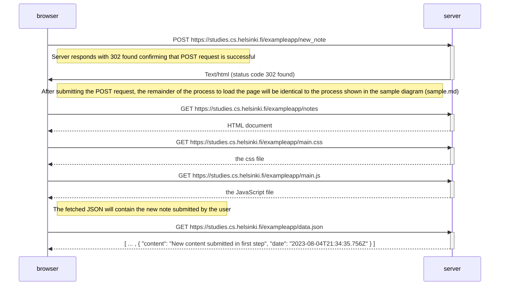

```mermaid
sequenceDiagram
    participant browser
    participant server

    browser->>server: POST https://studies.cs.helsinki.fi/exampleapp/new_note
    activate server
    Note right of browser: Server responds with 302 found confirming that POST request is successful
    server->>browser: Text/html (status code 302 found)
    deactivate server

    Note right of browser: After submitting the POST request, the remainder of the process to load the page will be identical to the process shown in the sample diagram (sample.md)
    browser->>server: GET https://studies.cs.helsinki.fi/exampleapp/notes
    activate server
    server-->>browser: HTML document
    deactivate server
    
    browser->>server: GET https://studies.cs.helsinki.fi/exampleapp/main.css
    activate server
    server-->>browser: the css file
    deactivate server

    browser->>server: GET https://studies.cs.helsinki.fi/exampleapp/main.js
    activate server
    server-->>browser: the JavaScript file
    deactivate server

    Note right of browser: The fetched JSON will contain the new note submitted by the user
    browser->>server: GET https://studies.cs.helsinki.fi/exampleapp/data.json
    activate server
    server-->>browser: [ ... , { "content": "New content submitted in first step", "date": "2023-08-04T21:34:35.756Z" } ]
    deactivate server
```