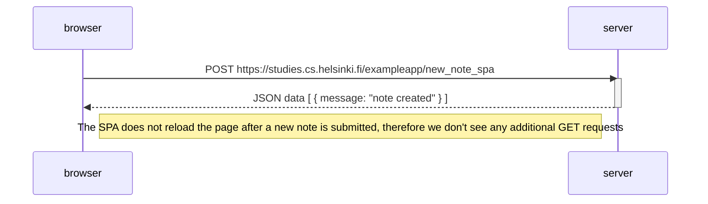

```mermaid
sequenceDiagram
    participant browser
    participant server

    browser->>server: POST https://studies.cs.helsinki.fi/exampleapp/new_note_spa
    activate server
    server-->>browser: JSON data [ { message: "note created" } ]
    deactivate server

    Note right of browser: The SPA does not reload the page after a new note is submitted, therefore we don't see any additional GET requests
```